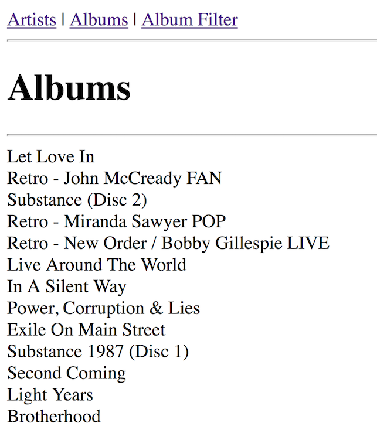
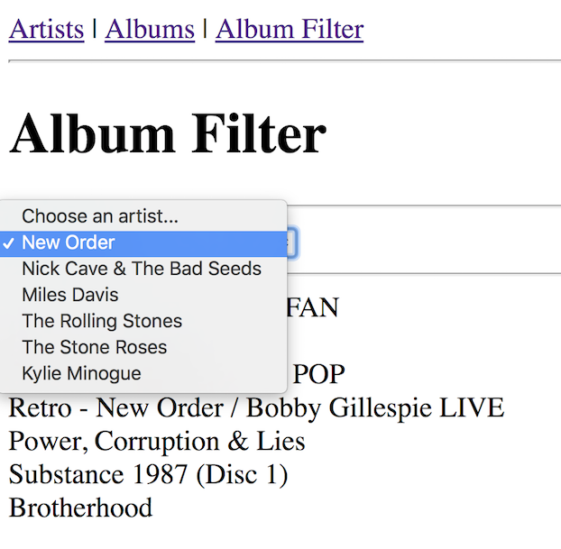
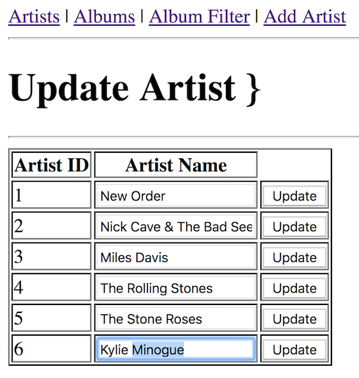

# Node.js Exercise 7 – Music Website & JSON API
		
> Complete ALL the exercises in this section.

## Fetch latest Repository Branch

```
$ cd /DRIVE/xampp/htdocs/nodejs
$ git pull --no-edit https://github.com/noucampdotorgWD12018/nodejs.git latest
$ git status

```

Checkout the files in the new folder ``nodejs/musicSite``

## Part 1 – Run XAMPP

1.  From the Command Prompt window run your XAMPP web server

1.  View this [artists.html](http://localhost/nodejs/musicSite/artists.html) page.  We'll run our JSON API App so data can be sent to this page.

## Part 2 – Setup and Run JSON API

1.	From the Command Prompt window change to the ``nodejs/musicSite`` folder.

1.  Setup a ``package.json`` file by running:

    ```
    npm init
    ```

1.  Install the ``mysql`` package:

    ```
    npm install mysql --save
    ```

1.  Run the JSON API server:

    ```
    node index.js
    ```

1.  Test its working by using this URL [http://localhost:3000/?page=artist](http://localhost:3000/?page=artist)

1.  **Examine** the code and **understand** how you are seeing JSON data of the ``artist`` table.

1.  View [artists.html](http://localhost/nodejs/musicSite/artists.html) again.  You should see artist names now.

1.  **Examine** the code and **understand** how this is working.  Ask if you don't know.


## Part 3 – Album JSON Data

1.  Modify the code in ``index.js`` so by using this URL [http://localhost:3000/?page=album](http://localhost:3000/?page=album) you get this data:

    ```javascript
    [{"artist_id":2,"album_id":1,"album_name":"Let Love In"},{"artist_id":1,"album_id":1,"album_name":"Retro - John McCready FAN"},{"artist_id":1,"album_id":2,"album_name":"Substance (Disc 2)"},{"artist_id":1,"album_id":3,"album_name":"Retro - Miranda Sawyer POP"},{"artist_id":1,"album_id":4,"album_name":"Retro - New Order / Bobby Gillespie LIVE"},{"artist_id":3,"album_id":1,"album_name":"Live Around The World"},{"artist_id":3,"album_id":2,"album_name":"In A Silent Way"},{"artist_id":1,"album_id":5,"album_name":"Power, Corruption & Lies"},{"artist_id":4,"album_id":1,"album_name":"Exile On Main Street"},{"artist_id":1,"album_id":6,"album_name":"Substance 1987 (Disc 1)"},{"artist_id":5,"album_id":1,"album_name":"Second Coming"},{"artist_id":6,"album_id":1,"album_name":"Light Years"},{"artist_id":1,"album_id":7,"album_name":"Brotherhood"}]

    ```

    Do not continue until you have this working.

1.  Modify the code in ``index.js`` so by using this URL [http://localhost:3000/?page=albumFilter&artist_id=1](http://localhost:3000/?page=albumFilter&artist_id=1) you get this data:

    ```java
    [{"artist_id":1,"album_id":1,"album_name":"Retro - John McCready FAN"},{"artist_id":1,"album_id":2,"album_name":"Substance (Disc 2)"},{"artist_id":1,"album_id":3,"album_name":"Retro - Miranda Sawyer POP"},{"artist_id":1,"album_id":4,"album_name":"Retro - New Order / Bobby Gillespie LIVE"},{"artist_id":1,"album_id":5,"album_name":"Power, Corruption & Lies"},{"artist_id":1,"album_id":6,"album_name":"Substance 1987 (Disc 1)"},{"artist_id":1,"album_id":7,"album_name":"Brotherhood"}]
    ```

    Note, it filters New Order (artist_id=1) albums.  Try this URL [http://localhost:3000/?page=albumFilter&artist_id=4](http://localhost:3000/?page=albumFilter&artist_id=4) to filter Rolling Stones albums
    
1.  Push your code to your private repository on GitHub. Type these commands into your Git Bash client:

    ```
    $ cd /<DRIVE>/xampp/htdocs/nodejs
    $ git status
    $ git add .
    $ git commit -m "Exercise 7 Part 3 - DONE|PARTIAL|HELP"
    $ git push origin master
    $ git status
    ```

## Part 4 – Website Pages

1.  Make the necessary ammendments to ``albums.js`` to get the URL [albums.html](http://localhost/nodejs/musicSite/albums.html) looking like this:

    

    Use the URL tested earlier to get the data you want.

1.  Make the necessary ammendments to ``albumFilter.js`` to get the URL [albumFilter.html](http://localhost/nodejs/musicSite/albumFilter.html) looking like this:

    

    Firstly, the dropdown box will have the names of the artists.

    Secondly, by choosing an artist from the dropdown should show album(s) for just that artist.

1.  In your ``musicSite`` folder create two new files - ``artistAdd.html`` and ``artistAdd.js``.  
    Add the code necessary to display an Add Artist webpage like the one below.  When artist details are provided *INSERT* the data into the existing ``artists`` table.

    

    Check it works by using this URL [http://localhost/nodejs/musicSite/artistAdd.html](http://localhost/nodejs/musicSite/artistAdd.html)

1.  Finally, in your ``musicSite`` folder create two new files - ``artistUpdate.html`` and ``artistUpdate.js``.  
    Add the code necessary to display an Update Artist webpage like the one below.  
    
    Use the *Mustache* template engine to render the artist details within a HTML table.

    When an *Update* button is pressed provide the appropriate code to update the artist name.

    

    Check it works by using this URL [http://localhost/nodejs/musicSite/artistUpdate.html](http://localhost/nodejs/musicSite/artistUpdate.html)
    
1.  Push your code to your private repository on GitHub. Type these commands into your Git Bash client:

    ```
    $ cd /<DRIVE>/xampp/htdocs/nodejs
    $ git status
    $ git add .
    $ git commit -m "Exercise 7 Part 4 - DONE|PARTIAL|HELP"
    $ git push origin master
    $ git status
    ```